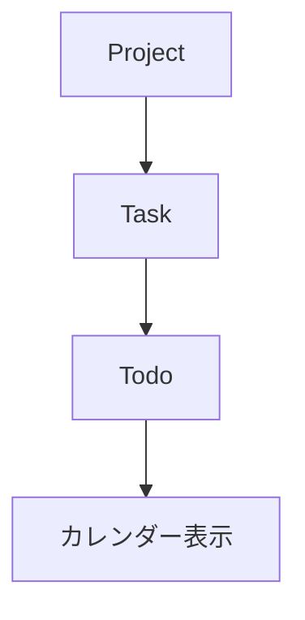
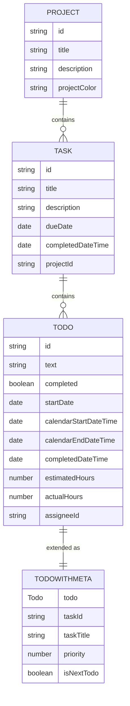
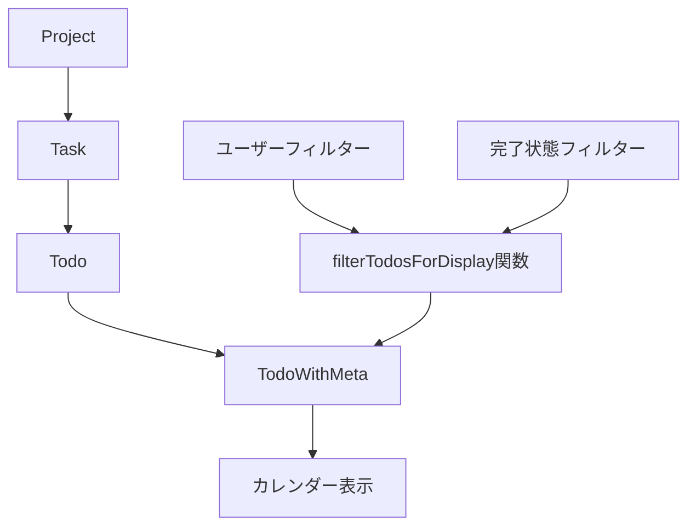
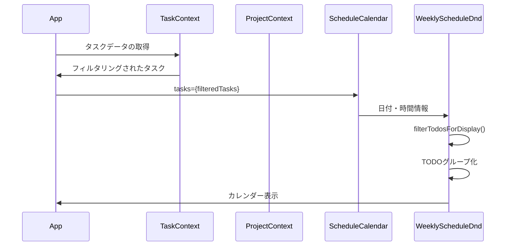
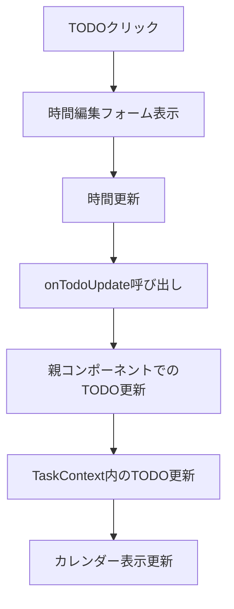

# カレンダーマッピング処理の詳細

## 概要

このドキュメントでは、TODOアイテムをカレンダーに表示するためのデータ構造とマッピング処理について説明します。

## データ構造の概要

カレンダー表示のためのデータ構造は以下のような階層になっています：



## データの関連図



## 基本データ型

### Todo

```typescript
interface Todo {
  id: string;
  text: string;
  completed: boolean;
  startDate: Date;               // 着手予定日
  calendarStartDateTime: Date;   // カレンダー表示用開始日時
  calendarEndDateTime: Date;     // カレンダー表示用終了日時
  completedDateTime?: Date;      // 完了日時
  estimatedHours: number;        // 見積もり工数（時間単位）
  actualHours: number;           // 実績工数（時間単位）
  assigneeId: string;            // 担当者ID
}
```

### Task

```typescript
interface Task {
  id: string;
  title: string;
  description: string;
  dueDate: Date;                 // 期日
  completedDateTime?: Date;      // 完了日時
  todos: Todo[];                 // TODOリスト
  projectId: string;             // タスクが属するプロジェクトのID
}
```

### Project

```typescript
interface Project {
  id: string;
  title: string;
  description: string;
  projectColor: string;
  tasks: Task[];                 // タスクリスト
}
```

## 拡張データ型（カレンダー表示用）

### TodoWithMeta

カレンダー表示のために、Todoに追加のメタデータを付与した型です。

```typescript
interface TodoWithMeta {
  todo: Todo;                    // 元のTodoデータ
  taskId: string;                // 所属タスクID
  taskTitle: string;             // タスク名
  priority?: number;             // 優先度
  isNextTodo: boolean;           // 次に取り組むべきTODOかどうか
}
```

## データマッピング図



## カレンダー表示のデータマッピング概念図

```
+----------------------------------------------------------+
|                       カレンダー表示                        |
+------------------+-------------------+-------------------+
|     月曜日        |      火曜日        |      水曜日        |
+------------------+-------------------+-------------------+
| 9:00             |                   |                   |
|  +------------+  |                   |                   |
|  | TODO 1     |  |                   |                   |
|  | taskA      |  |                   |                   |
|  +------------+  |                   |                   |
| 10:00            |                   |  +------------+   |
|                  |                   |  | TODO 3     |   |
|                  |  +------------+   |  | taskC      |   |
|                  |  | TODO 2     |   |  +------------+   |
|                  |  | taskB      |   |                   |
| 11:00            |  +------------+   |                   |
|                  |                   |                   |
|  ↑               |                   |                   |
|  |               |                   |                   |
|  |               |                   |                   |
|  +-- TodoWithMeta[] <-- filterTodosForDisplay() <-- Task[]の中のTodoリスト
```

## 時間重複に対するグループ化の仕組み

```
+----------------------------------------------------------+
|                       時間重複の処理                        |
+----------------------------------------------------------+
|                                                          |
|  時間が重なるTODO                    時間が重ならないTODO       |
|                                                          |
|  TODO A: 9:00-11:00                TODO C: 9:00-10:00    |
|  TODO B: 10:00-12:00                                     |
|                                                          |
|        ↓ 重複チェック                    ↓ 重複チェック         |
|                                                          |
|  todoGroups = [                    todoGroups = [        |
|    [TODO A, TODO B]                  [TODO C]           |
|  ]                                 ]                     |
|                                                          |
|        ↓ 表示                          ↓ 表示              |
|                                                          |
|  +-------------+                    +-------------+      |
|  |   TODO A    |                    |   TODO C    |      |
|  +-------------+                    +-------------+      |
|  |   TODO B    |                                         |
|  +-------------+                                         |
|                                                          |
+----------------------------------------------------------+
```

## カレンダー表示時のデータ変換

### 1. TODOフィルタリング処理

```typescript
// filterTodosForDisplay関数（簡略化）
function filterTodosForDisplay(tasks: Task[], selectedUserIds: string[], showUnassigned: boolean): Map<string, TodoWithMeta[]> {
  const todos = new Map<string, TodoWithMeta[]>();
  
  tasks.forEach(task => {
    task.todos.forEach(todo => {
      // ユーザーフィルター適用
      if (
        selectedUserIds.length > 0 &&
        !selectedUserIds.includes(todo.assigneeId) &&
        !(showUnassigned && !todo.assigneeId)
      ) {
        return;
      }
      
      if (!todo.calendarStartDateTime || !todo.calendarEndDateTime) return;
      
      // 日付ごとにTODOを分類
      const dateKey = format(todo.calendarStartDateTime, 'yyyy-MM-dd');
      
      const todoWithMeta: TodoWithMeta = {
        todo,
        taskId: task.id,
        taskTitle: task.title,
        isNextTodo: false,  // 後で計算
      };
      
      if (!todos.has(dateKey)) {
        todos.set(dateKey, []);
      }
      
      todos.get(dateKey)?.push(todoWithMeta);
    });
  });
  
  return todos;
}
```

### 2. 重複TODOの表示処理

同じ時間帯に複数のTODOがある場合、それらを並べて表示するためのグループ化処理：

```typescript
// 重なりがあるTODOをグループ化
const todoGroups: TodoWithMeta[][] = [];
todosForHour.forEach(todo => {
  let added = false;
  for (const group of todoGroups) {
    // 重複チェック - 時間が重なっているかどうか
    const hasOverlap = group.some(existingTodo => {
      const start1 = new Date(todo.todo.calendarStartDateTime!).getTime();
      const end1 = new Date(todo.todo.calendarEndDateTime!).getTime();
      const start2 = new Date(existingTodo.todo.calendarStartDateTime!).getTime();
      const end2 = new Date(existingTodo.todo.calendarEndDateTime!).getTime();
      
      // 時間が重なっている場合はtrue
      return (start1 < end2 && end1 > start2);
    });
    
    // 重複がない場合のみ、このグループに追加
    if (!hasOverlap) {
      group.push(todo);
      added = true;
      break;
    }
  }
  if (!added) {
    // 新しいグループを作成
    todoGroups.push([todo]);
  }
});
```

## データフロー図



## カレンダー内でのTODO操作

### 1. TODOの時間編集

1. TODOをクリックすると編集フォームが表示される
2. 開始時間と終了時間を選択
3. 更新ボタンをクリックすると以下の処理が実行される:

```typescript
const handleTimeUpdate = () => {
  if (!editingTodo || !onTodoUpdate) return;

  const { todo, taskId, startTime, endTime } = editingTodo;
  const [startHour, startMinute] = startTime.split(':').map(Number);
  const [endHour, endMinute] = endTime.split(':').map(Number);

  const updatedStartDateTime = new Date(todo.calendarStartDateTime);
  updatedStartDateTime.setHours(startHour, startMinute, 0, 0);

  const updatedEndDateTime = new Date(todo.calendarEndDateTime);
  updatedEndDateTime.setHours(endHour, endMinute, 0, 0);

  onTodoUpdate(todo.id, taskId, updatedStartDateTime, updatedEndDateTime);
};
```

### 2. 新規TODO作成

1. カレンダーの空白部分をクリックすると新規TODO作成モーダルが表示される
2. 日付と時間は自動的にクリックした場所に設定される
3. タスク、TODO名、見積工数を入力して作成

## データ更新フロー



このドキュメントが、カレンダーマッピング処理の理解に役立つことを願っています。 