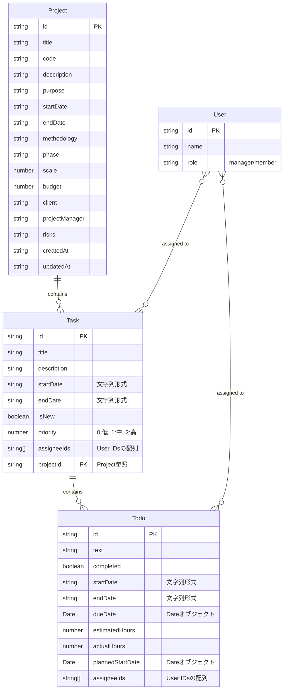

# プロジェクト管理システム データモデル

## ER図（Entity Relationship Diagram）

以下はプロジェクト、タスク、TODO、ユーザー間の関係を表すER図です。

## 現状のデータモデルの問題点

1. **型の不一致**: 日付フィールドが文字列形式（`startDate`, `endDate`）とDateオブジェクト（`dueDate`, `plannedStartDate`）で混在しています。

2. **任意プロパティの多用**: 多くのフィールドが任意（optional）として定義されており、型安全性が低下しています。

3. **アサイン情報の二重管理**: タスクとTODOの両方に`assigneeIds`が存在し、その関係性が明確ではありません。
   - TODOにアサインされたユーザーがタスク全体にもアサインされているべきか？
   - タスクにアサインされたユーザーは全てのTODOにもアサインされるべきか？

4. **プロパティ名の不明確さ**: `startDate`や`endDate`が時間情報を含むのかが明確ではありません。

## データフロー

- タスク作成時にはプロジェクトIDが割り当てられます
- TODOの追加時、タスクの`todos`配列に追加されます
- TODOのアサイン情報が変更されると、タスク全体のアサイン情報も更新される仕組みになっています 