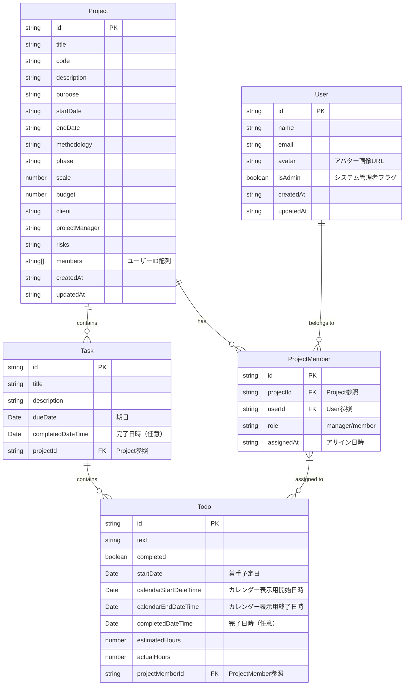

# プロジェクト管理システム データモデル

## ER図（Entity Relationship Diagram）

以下はプロジェクト、タスク、TODO、ユーザー、プロジェクトメンバー間の関係を表すER図です。

## 現状のデータモデルの問題点と改善後のモデル

### 問題点
1. **型の不一致**: 日付フィールドが文字列形式（`startDate`, `endDate`）とDateオブジェクト（`dueDate`, `plannedStartDate`）で混在していました。

2. **任意プロパティの多用**: 多くのフィールドが任意（optional）として定義されており、型安全性が低下していました。

3. **アサイン情報の二重管理**: タスクとTODOの両方に`assigneeIds`が存在し、その関係性が明確ではありませんでした。

4. **プロパティ名の不明確さ**: `startDate`や`endDate`が時間情報を含むのかが明確ではありませんでした。

5. **ロール管理の不整合**: システム全体のユーザーロールとプロジェクト単位のロールが分離しており、権限管理が複雑でした。

6. **アサイン構造の不適切さ**: TODOが直接Userに紐づいていたため、プロジェクトメンバーシップの管理が不十分でした。

### 改善内容
1. **日付プロパティの整理**: 
   - タスクには`dueDate`（期日）と`completedDateTime`（完了日時）のみを残しました
   - TODOには`startDate`（着手予定日）、`calendarStartDateTime`/`calendarEndDateTime`（カレンダー表示用）、`completedDateTime`（完了日時）を定義しました

2. **型の統一**: 
   - すべての日付関連フィールドをDateオブジェクトに統一しました
   - 文字列形式の日付は廃止しました

3. **不要プロパティの削除**: 
   - タスクの`startDate`/`endDate`は削除しました（`dueDate`のみで十分）
   - TODOの`dueDate`/`plannedStartDate`は整理して`startDate`に統一しました
   - タスクの`assigneeIds`を削除しました（子TODOのアサイン情報から計算可能なため）

4. **プロパティ名の明確化**: 
   - 日時情報を含むプロパティ名には`DateTime`を含めて明示化しました
   - 単純な日付のみを扱うプロパティには`Date`を使用しました

5. **ロール管理の統一**:
   - ユーザーモデルからロール属性を削除し、システム管理者フラグ（`isAdmin`）のみを保持
   - プロジェクト単位でのロール（`ProjectMember.role`）に権限管理を一元化
   - プロジェクト内での役割がそのプロジェクト内のタスク・TODOに対する権限を決定する設計

6. **アサイン構造の改善**:
   - TODOのアサイン先を`User`から`ProjectMember`に変更
   - これにより、TODOは必ずプロジェクトメンバーにのみアサイン可能に
   - プロジェクトメンバーのロールに基づいた権限管理が可能に

## データフロー

- タスク作成時にはプロジェクトIDと期日（`dueDate`）が設定されます
- TODOの追加時、タスクの`todos`配列に追加されます
- TODOの着手予定日（`startDate`）はカレンダー上で設定・変更できます
- TODOが完了すると`completedDateTime`が設定されます
- タスク内のすべてのTODOが完了すると、タスクの`completedDateTime`が設定されます
- タスクの担当者情報は、子TODOのアサイン情報から動的に計算されます
- ユーザーをプロジェクトにアサインする際、`ProjectMember`エンティティが作成され、ロールが設定されます
- TODOは必ずプロジェクトメンバー（`ProjectMember`）にアサインされ、プロジェクト外のユーザーへのアサインは不可能です
- ユーザーのプロジェクト内での権限は、そのプロジェクトの`ProjectMember.role`に基づいて決定されます
- プロジェクト内のタスクやTODOに対する操作権限は、プロジェクトメンバーのロールから継承されます

## ロールと権限管理システム

### システムレベルの権限
- **管理者（isAdmin = true）**：
  - すべてのプロジェクトへのアクセス
  - すべてのユーザー情報の管理
  - システム設定の変更

- **一般ユーザー（isAdmin = false）**：
  - 参加しているプロジェクトのみアクセス可能
  - 自分のユーザー情報の編集のみ

### プロジェクトレベルの権限（ProjectMember.role）
プロジェクト内での役割に基づく権限は以下のとおりです：

1. **マネージャー（manager）**
   - プロジェクト情報の編集
   - メンバーの追加・削除・ロール変更
   - タスクの作成・編集・削除
   - すべてのTODO項目の編集

2. **メンバー（member）**
   - タスクの作成・編集
   - 自分に割り当てられたTODO項目の編集
   - プロジェクト情報の閲覧

### 権限の継承
- プロジェクト内でのユーザーの権限は、そのプロジェクトでの役割（`ProjectMember.role`）から継承されます
- 例えば、あるプロジェクトでマネージャーの役割を持つユーザーは、そのプロジェクト内のすべてのタスクとTODOに対して編集権限を持ちます
- 同じユーザーでも、異なるプロジェクトでは異なる役割と権限を持つことができます 