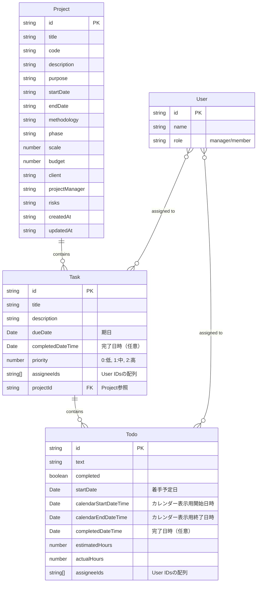

# プロジェクト管理システム データモデル

## ER図（Entity Relationship Diagram）

以下はプロジェクト、タスク、TODO、ユーザー間の関係を表すER図です。

## 現状のデータモデルの問題点と改善後のモデル

### 問題点
1. **型の不一致**: 日付フィールドが文字列形式（`startDate`, `endDate`）とDateオブジェクト（`dueDate`, `plannedStartDate`）で混在していました。

2. **任意プロパティの多用**: 多くのフィールドが任意（optional）として定義されており、型安全性が低下していました。

3. **アサイン情報の二重管理**: タスクとTODOの両方に`assigneeIds`が存在し、その関係性が明確ではありませんでした。

4. **プロパティ名の不明確さ**: `startDate`や`endDate`が時間情報を含むのかが明確ではありませんでした。

### 改善内容
1. **日付プロパティの整理**: 
   - タスクには`dueDate`（期日）と`completedDateTime`（完了日時）のみを残しました
   - TODOには`startDate`（着手予定日）、`calendarStartDateTime`/`calendarEndDateTime`（カレンダー表示用）、`completedDateTime`（完了日時）を定義しました

2. **型の統一**: 
   - すべての日付関連フィールドをDateオブジェクトに統一しました
   - 文字列形式の日付は廃止しました

3. **不要プロパティの削除**: 
   - タスクの`startDate`/`endDate`は削除しました（`dueDate`のみで十分）
   - TODOの`dueDate`/`plannedStartDate`は整理して`startDate`に統一しました

4. **プロパティ名の明確化**: 
   - 日時情報を含むプロパティ名には`DateTime`を含めて明示化しました
   - 単純な日付のみを扱うプロパティには`Date`を使用しました

## データフロー

- タスク作成時にはプロジェクトIDと期日（`dueDate`）が設定されます
- TODOの追加時、タスクの`todos`配列に追加されます
- TODOの着手予定日（`startDate`）はカレンダー上で設定・変更できます
- TODOが完了すると`completedDateTime`が設定されます
- タスク内のすべてのTODOが完了すると、タスクの`completedDateTime`が設定されます
- TODOのアサイン情報が変更されると、タスク全体のアサイン情報も更新される仕組みになっています 