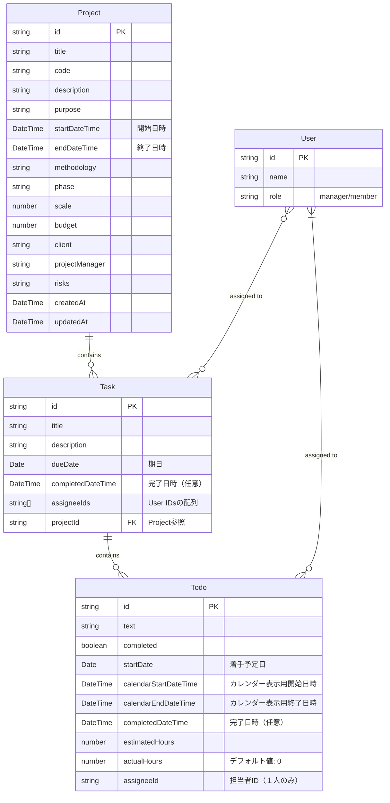

# プロジェクト管理システム 改善データモデル

## ER図（改善案）

以下は現状のデータモデルの問題点を解消するための改善案のER図です。



## 主な改善点

1. **日付プロパティの整理**: 
   - タスクには`dueDate`（期日）と`completedDateTime`（完了日時）のみを残す
   - TODOには`startDate`（着手予定日）、`calendarStartDateTime`/`calendarEndDateTime`（カレンダー表示用）、`completedDateTime`（完了日時）を定義

2. **型の統一**: 
   - すべての日付関連フィールドをDateオブジェクトに統一
   - 単なる日付のみを扱うものは`Date`型、時間情報も含むものは`DateTime`型として明示

3. **不要プロパティの削除**: 
   - タスクの`startDate`/`endDate`は削除（`dueDate`のみで十分）
   - TODOの`dueDate`/`plannedStartDate`は整理して`startDate`に統一

4. **プロパティ名の明確化**:
   - 日時情報を含むプロパティ名には`DateTime`を含めて明示化
   - 単純な日付のみを扱うプロパティには`Date`を使用

## 移行計画

1. **型定義の更新**:
```typescript
interface Task {
  id: string;
  title: string;
  description: string;
  dueDate: Date;                // 期日
  completedDateTime?: Date;     // 完了日時（任意）
  assigneeIds: string[];
  projectId: string;
  todos: Todo[];
}

interface Todo {
  id: string;
  text: string;
  completed: boolean;
  startDate: Date;              // 着手予定日
  calendarStartDateTime: Date;  // カレンダー表示用開始日時
  calendarEndDateTime: Date;    // カレンダー表示用終了日時
  completedDateTime?: Date;     // 完了日時（任意）
  estimatedHours: number;
  actualHours: number;          // デフォルト値: 0
  assigneeId: string;           // 担当者ID（１人のみ）
}
```

2. **既存データの変換ユーティリティの作成**:
   - 既存の文字列形式の日付からDateオブジェクトへの変換
   - カレンダー表示用の日時情報の計算（着手予定日 + 予定工数から算出）
   - 完了状態の場合の完了日時の設定

3. **フロントエンド側の表示ロジック修正**:
   - 日付表示UI、入力フォームの更新
   - カレンダーやガントチャート表示の修正
   - 新しい日付処理ロジックへの切り替え 