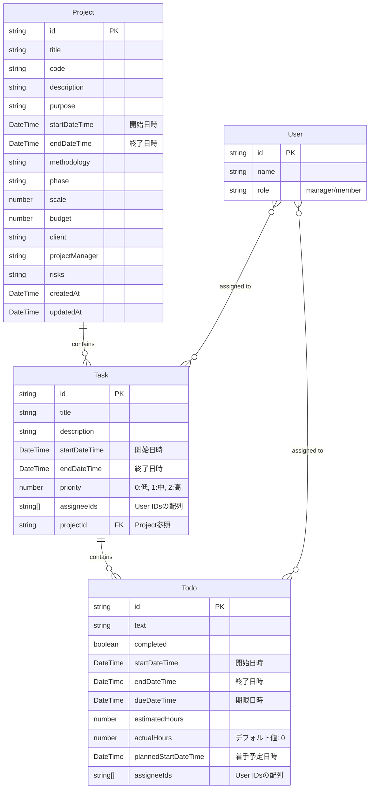

# プロジェクト管理システム 改善データモデル

## ER図（改善案）

以下は現状のデータモデルの問題点を解消するための改善案のER図です。



## 主な改善点

1. **型の統一**: 
   - すべての日付関連フィールドを`DateTime`型に統一
   - 名前も`startDate`→`startDateTime`のように明確化

2. **任意プロパティの整理**: 
   - 真に任意なプロパティのみを任意（optional）に
   - それ以外にはデフォルト値を設定（例：`actualHours`は0など）

3. **アサイン関係の明確化**: 
   - アサイン情報の同期ルールの明確化
   - TODOのアサイン情報が変更されたら、タスクのアサイン情報に自動反映

4. **日付・時間情報の明確化**:
   - 日付だけなのか、時間情報も含むのかを名前で明確化
   - `startDate` → `startDateTime`として時間情報も含むことを明示

## 移行計画

1. **型定義の更新**:
```typescript
interface Task {
  id: string;
  title: string;
  description: string;
  startDateTime: Date;  // 文字列からDate型に変更
  endDateTime: Date;    // 文字列からDate型に変更
  priority: number;     // デフォルト値: 0
  assigneeIds: string[];
  projectId: string;
  todos: Todo[];
}

interface Todo {
  id: string;
  text: string;
  completed: boolean;
  startDateTime: Date;
  endDateTime: Date;
  dueDateTime: Date;
  estimatedHours: number;
  actualHours: number;  // デフォルト値: 0
  plannedStartDateTime: Date;
  assigneeIds: string[];
}
```

2. **既存データの変換ユーティリティの作成**:
   - 既存の文字列形式の日付からDateオブジェクトへの変換
   - 不足情報の補完（時間情報がない場合は00:00:00として扱うなど）

3. **フロントエンド側の表示ロジック修正**:
   - 日付選択UI、表示フォーマットの統一
   - 時間情報の編集も可能に 