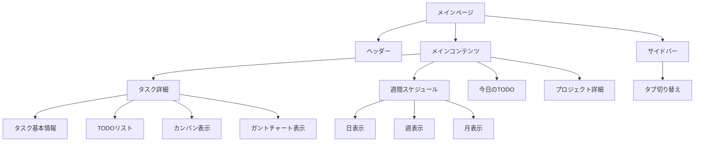

# プロジェクト管理システム 仕様概要

## 1. システム概要

このシステムは、Next.jsを使用したプロジェクト管理アプリケーションです。主に以下の機能を提供しています：

- プロジェクト管理
- タスク管理
- TODO（サブタスク）管理
- スケジュール管理
- ユーザー管理とタスクの割り当て

## 2. 主要機能

### プロジェクト管理
- プロジェクトの作成・編集・詳細表示
- プロジェクト一覧表示
- プロジェクト状態の管理

### タスク管理
- タスクの作成・編集・削除
- タスクの詳細表示
- タスクの進捗管理
- タスクのフィルタリングと並べ替え
- タスクの担当者割り当て

### TODO（サブタスク）管理
- TODOの作成・編集・削除
- TODOの完了状態の切り替え
- TODOの見積もり工数と実績工数の管理
- TODOの担当者割り当て
- OpenAIを使用したTODO自動生成機能

### スケジュール管理
- 日・週・月単位のカレンダー表示
- ドラッグ＆ドロップによるTODOのスケジュール変更
- 優先度に基づく自動スケジューリング
- 当日のTODO一覧表示
- TODOの着手予定日と期限日の管理

### ビュー機能
- リスト表示
- カンバン表示
- ガントチャート表示
- 週間スケジュール表示

### フィルタリングと検索
- ユーザーによるフィルタリング
- 未割り当てタスクの表示・非表示
- タスクの優先度・期限によるソート

## 3. UIコンポーネント

### メインコンポーネント
- `Header`: アプリケーションのヘッダー部分
- `Sidebar`: ナビゲーションサイドバー
- `TaskDetail`: タスク詳細表示と編集
- `WeeklySchedule`: 週間スケジュール表示
- `TodayTodo`: 当日のTODO一覧
- `KanbanView`: カンバン形式のタスク表示
- `GanttChartView`: ガントチャート形式のタスク表示
- `ProjectDetail`: プロジェクト詳細表示
- `UserFilter`: ユーザーによるフィルタリング
- `TaskCreationForm`: タスク作成フォーム

### ポップアップ・モーダル
- `ProjectCreateModal`: プロジェクト作成モーダル
- `ProjectDetailModal`: プロジェクト詳細モーダル
- `TaskModal`: タスク操作モーダル

## 4. 技術スタック

- **フロントエンド**: Next.js, React, TypeScript, TailwindCSS
- **状態管理**: コンテキストAPI
- **UI/UXライブラリ**: React-Icons, hello-pangea/dnd（ドラッグ＆ドロップ）
- **ユーティリティ**: date-fns（日付操作）
- **AI統合**: OpenAI API（TODOの自動生成）

## 5. 現状の課題点

1. **データ構造の不一致**：
   - 日付の扱いが一貫していない（文字列とDateオブジェクトが混在）
   - タスクとTODOの担当者割り当て関係が複雑

2. **スケジューリングロジックの複雑さ**：
   - `WeeklySchedule.tsx`のスケジューリングロジックが複雑で長大
   - 自動スケジューリングの挙動が直感的でない可能性

3. **コンポーネントの肥大化**：
   - 複数のコンポーネントが1000行を超えている
   - 機能が密結合している可能性

4. **状態管理の複雑化**：
   - プロップドリルが発生している
   - 複数のコンテキストが存在している

5. **ディレクトリ構造の改善余地**：
   - 機能ごとのモジュール分割が不完全

## 6. 今後の改善案

1. **データモデルの整理**：
   - 日付の型を統一（すべてDateオブジェクトで管理）
   - タスクとTODOの関係を明確に
   - 担当者割り当てのモデルを整理

2. **状態管理の改善**：
   - グローバル状態管理の導入またはコンテキストの整理
   - 状態の更新ロジックの一元化

3. **コンポーネントのリファクタリング**：
   - 大きなコンポーネントを機能単位で分割
   - 共通処理をカスタムフックとして抽出

4. **機能分離**：
   - UIとビジネスロジックの分離
   - データアクセス層の抽象化

5. **型定義の強化**：
   - 共通型定義の整理
   - 厳格な型チェックの適用

6. **テストの導入**：
   - ユニットテスト
   - コンポーネントテスト
   - E2Eテスト 