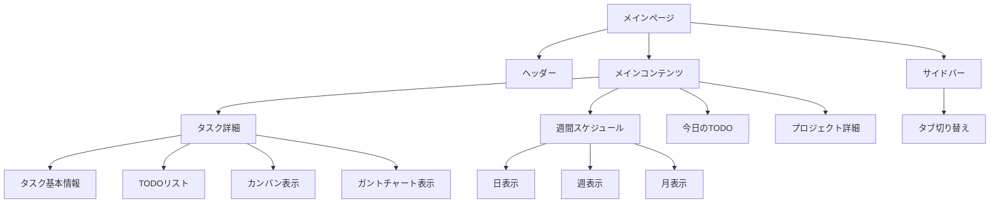

# プロジェクト管理システム 仕様概要

## 1. システム概要

このシステムは、Next.jsを使用したプロジェクト管理アプリケーションです。主に以下の機能を提供しています：

- プロジェクト管理
- タスク管理
- TODO（サブタスク）管理
- スケジュール管理
- ユーザー管理とタスクの割り当て

## 2. 主要機能

### プロジェクト管理
- プロジェクトの作成・編集・詳細表示
- プロジェクト一覧表示
- プロジェクト状態の管理
- プロジェクトごとのタスクフィルタリング

### タスク管理
- タスクの作成・編集・削除
- タスクの詳細表示
- タスクの進捗管理
- タスクのフィルタリングと並べ替え
- タスクの担当者割り当て
- 共通のタスク作成フォームを使用した一貫したUI

### TODO（サブタスク）管理
- TODOの作成・編集・削除
- TODOの完了状態の切り替え
- TODOの見積もり工数と実績工数の管理
- TODOの担当者割り当て
- OpenAIを使用したTODO自動生成機能

### スケジュール管理
- 日・週・月単位のカレンダー表示
- ドラッグ＆ドロップによるTODOのスケジュール変更
- 優先度に基づく自動スケジューリング
- 当日のTODO一覧表示
- TODOの着手予定日と期限日の管理

### ビュー機能
- リスト表示
- カンバン表示（進捗率によるタスク分類）
- ガントチャート表示
- 週間スケジュール表示

### フィルタリングと検索
- ユーザーによるフィルタリング
- プロジェクトによるフィルタリング
- 未割り当てタスクの表示・非表示
- タスクの優先度・期限によるソート

## 3. UIコンポーネント

### メインコンポーネント
- `Header`: アプリケーションのヘッダー部分
- `Sidebar`: ナビゲーションサイドバー
- `TaskDetail`: タスク詳細表示と編集
- `WeeklySchedule`: 週間スケジュール表示
- `TodayTodo`: 当日のTODO一覧
- `KanbanView`: カンバン形式のタスク表示（共通のTaskCreationFormを使用）
- `GanttChartView`: ガントチャート形式のタスク表示
- `ProjectDetail`: プロジェクト詳細表示
- `UserFilter`: ユーザーによるフィルタリング
- `TaskCreationForm`: タスク作成フォーム（複数ビューで共通利用される）

### ポップアップ・モーダル
- `ProjectCreateModal`: プロジェクト作成モーダル
- `ProjectDetailModal`: プロジェクト詳細モーダル

## 4. 技術スタック

- **フロントエンド**: Next.js, React, TypeScript, TailwindCSS
- **状態管理**: コンテキストAPI（TaskContext, ProjectContext, FilterContext）
- **ローカルストレージ**: データの永続化に使用
- **UI/UXライブラリ**: React-Icons, hello-pangea/dnd（ドラッグ＆ドロップ）
- **ユーティリティ**: date-fns（日付操作）
- **AI統合**: OpenAI API（TODOの自動生成）

## 5. 現状の課題点と改善状況

1. **データ構造の整理**：
   - ✅ 日付の扱いを統一（すべてDateオブジェクトで管理するように改善）
   - ✅ タスクとTODOの関係を明確化
   - 🔄 担当者割り当てモデルの整理は進行中

2. **コンポーネントの共通化**：
   - ✅ タスク作成フォームの共通化（KanbanViewなど複数ビューで同じコンポーネントを使用）
   - 🔄 他のコンポーネントの共通化を継続的に推進

3. **機能分離とモジュール化**：
   - ✅ features/ディレクトリによる機能ごとのモジュール分割を実施
   - ✅ 各機能ごとにコンポーネント、コンテキスト、型定義を整理
   - 🔄 サービス層とデータアクセス層の分離は継続中

4. **状態管理の改善**：
   - ✅ 機能ごとのコンテキスト分割を実施（TaskContext, ProjectContext など）
   - 🔄 コンテキスト間の依存関係の整理は継続中
   - 🔄 グローバル状態管理ライブラリの導入検討

5. **コンポーネントの肥大化**：
   - 🔄 大きなコンポーネントの分割は継続中
   - 🔄 共通ロジックのカスタムフックへの抽出も継続中

## 6. 今後の改善案

1. **サーバー連携**：
   - バックエンドAPIとの連携実装
   - RESTful APIの設計と実装
   - データ同期メカニズムの構築

2. **ユーザー認証**：
   - ログイン・登録機能の追加
   - ロールベースのアクセス制御
   - セキュリティ強化

3. **パフォーマンス最適化**：
   - メモ化によるレンダリング最適化
   - 仮想スクロールの導入（大量のタスク・TODOの表示時）
   - コード分割とレイジーローディング

4. **ユーザーエクスペリエンス向上**：
   - ダークモードの実装
   - アクセシビリティ対応
   - モバイルレスポンシブ対応の強化

5. **テスト導入**：
   - ユニットテスト（Jest/React Testing Library）
   - インテグレーションテスト
   - E2Eテスト（Cypress/Playwright）

6. **インフラストラクチャ**：
   - CI/CDパイプラインの構築
   - デプロイ自動化
   - 監視とロギングの導入 